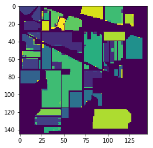

# Hyperspectral-Image-Segmentation
Semantic Segmentation of HyperSpectral Images using a U-Net with Separable Convolutions.

## IMPORTANT UPDATE
**Please do not use this codebase for your experiments**. 

In my opinion the results presented in this document is **not** a fair analysis for two reasons. 

Reason one is that there is data leakage between the train and val sets. Since patches are created using stride 1, it means that some patches have partial overlap with few other patches. And also since synthetic patches are created using smaller patches, some common information maybe present across various patches. Since the general and synthetic patches are first created, then concatenated and then finally split into train and val splits, there is data leakage.

Reason two is that I think the final performance mentioned in the document is over all pixels, which naturally would include the ones used for training as well. Hence the numbers may not be representative of the effectiveness of the models.

In retrospect, I also think the idea of synthetic patches is **not good**. This is because the smaller patches that make up a synthetic patch belong to different parts of the full image and hence the spatial context within a synthetic patch may not be useful.

Due to the above reasons, **please do not use this codebase**. Since this repo was created long ago I do not remember how/why things ended up this way. I wanted to post this update for quite a while now but I kept forgetting and/or postponing. I am truly sorry for the inconvenience.

Currently there are no plans to resolve the aforementioned issues and hence the repository will be made read-only. Hence, once again, **please do not use this codebase** and I am truly sorry for the inconvenience. If you have any questions, please send me an email (email ID will be available in my profile).

## Features
- HyperSpectral Images (HSI) are semantically segmented using two variants of U-Nets and their performance is comparaed.
- **Model A** uses Depthwise Separable Convolutions in the downsampling arm of the U-Net, and **Model B** uses Convolutions in the downsampling arm of the U-Net. 
- Due to the lack of multiple HSI image and ground truth pairs, we train the models by extracting patches of the image. Here, patches are smaller square regions of the image. After training the model, we make predictions patch-wise. 
- Patches are extracted using a stride of 1 for training. We used patches of size `patch_size = 4` (4x4 square regions) for our experiment.
- We use the `sample-weight` feature offered by Keras to weight the classes in the loss function by their log frequency. We use this as there is a skew in the number of examples per class.
- Some classes do not have patches of size `patch_size = 4`. For these classes, we create synthetic patches of size `patch_size = 4` by using patches of size 1. 
- Experimental results are tabulated below.

## Requirements
- Keras
- TensorFlow (>1.4)
- Scikit-Learn
- Numpy
- Scipy

## Instructions
1. Clone the repository and change working directory using:
```
git clone https://github.com/thatbrguy/Hyperspectral-Image-Segmentation.git \
&& cd Hyperspectral-Image-Segmentation
```
2. Download the dataset from [here](http://www.ehu.eus/ccwintco/index.php/Hyperspectral_Remote_Sensing_Scenes#Indian_Pines) **or** by using the following commands:
```
wget http://www.ehu.eus/ccwintco/uploads/6/67/Indian_pines_corrected.mat
wget http://www.ehu.eus/ccwintco/uploads/c/c4/Indian_pines_gt.mat
```
3. Train the model using:
```
python main.py \
--model A \
--mode train
```
The file `main.py` supports a few options, which are listed below:
- `--model`: (**required**) Choose between models `A` and `B`.
- `--mode`: (**required**) Choose between training (`train`) and inference (`infer`) modes.
- `--weights`: (**required for inference only**) Path of the weights file for inference mode. Pretrained weights for both models (`A` and `B`) are available in the `weights` directory.
- `--epochs`: Set the number of epochs. Default value is `100`.
- `--batch_size`: Set the batch size. Default value is `200`.
- `--lr`: Set the learning rate. Default value is `0.001`.

## Results

### Indian Pines Dataset

#### Output Maps
|    Ground Truth   	|         Model A        	|         Model B         	|
|:-----------------:	|:----------------------:	|:-----------------------:	|
|  	|  	|  	|

#### Epoch vs Accuracy
</img>

#### Tabulatation

<table>
  <tr>
    <th rowspan="2">Class Number</th>
    <th rowspan="2">Class Name</th>
    <th rowspan="2">Ground Truth Samples</th>
    <th colspan="2">Model A</th>
    <th colspan="2">Model B</th>
  </tr>
  <tr>
    <td>Predicted Samples</td>
    <td>Accuracy</td>
    <td>Predicted Samples</td>
    <td>Accuracy</td>
  </tr>
  <tr>
    <td>1</td>
    <td>Alfalfa</td>
    <td>46</td>
    <td>30</td>
    <td>65.21</td>
    <td>29</td>
    <td>63.04</td>
  </tr>
  <tr>
    <td>2</td>
    <td>Corn notill</td>
    <td>1428</td>
    <td>1343</td>
    <td>94.05</td>
    <td>1324</td>
    <td>92.72</td>
  </tr>
  <tr>
    <td>3</td>
    <td>Corn mintill</td>
    <td>830</td>
    <td>753</td>
    <td>90.72</td>
    <td>762</td>
    <td>91.81</td>
  </tr>
  <tr>
    <td>4</td>
    <td>Corn</td>
    <td>237</td>
    <td>189</td>
    <td>79.75</td>
    <td>186</td>
    <td>78.48</td>
  </tr>
  <tr>
    <td>5</td>
    <td>Grass pasture</td>
    <td>483</td>
    <td>449</td>
    <td>92.96</td>
    <td>439</td>
    <td>90.89</td>
  </tr>
  <tr>
    <td>6</td>
    <td>Grass trees</td>
    <td>730</td>
    <td>717</td>
    <td>98.22</td>
    <td>710</td>
    <td>97.26</td>
  </tr>
  <tr>
    <td>7</td>
    <td>Grass pasture mowed</td>
    <td>28</td>
    <td>28</td>
    <td>100</td>
    <td>28</td>
    <td>100</td>
  </tr>
  <tr>
    <td>8</td>
    <td>Hay windrowed</td>
    <td>478</td>
    <td>476</td>
    <td>99.58</td>
    <td>473</td>
    <td>98.95</td>
  </tr>
  <tr>
    <td>9</td>
    <td>Oats</td>
    <td>20</td>
    <td>20</td>
    <td>100</td>
    <td>7</td>
    <td>35</td>
  </tr>
  <tr>
    <td>10</td>
    <td>Soybean notill</td>
    <td>972</td>
    <td>843</td>
    <td>86.72</td>
    <td>844</td>
    <td>86.83</td>
  </tr>
  <tr>
    <td>11</td>
    <td>Soybean mintill</td>
    <td>2455</td>
    <td>2328</td>
    <td>94.83</td>
    <td>2311</td>
    <td>94.13</td>
  </tr>
  <tr>
    <td>12</td>
    <td>Soybean clean</td>
    <td>593</td>
    <td>524</td>
    <td>88.36</td>
    <td>530</td>
    <td>89.38</td>
  </tr>
  <tr>
    <td>13</td>
    <td>Wheat</td>
    <td>205</td>
    <td>175</td>
    <td>85.37</td>
    <td>176</td>
    <td>85.85</td>
  </tr>
  <tr>
    <td>14</td>
    <td>Woods</td>
    <td>1265</td>
    <td>1246</td>
    <td>98.50</td>
    <td>1229</td>
    <td>97.15</td>
  </tr>
  <tr>
    <td>15</td>
    <td>Buildings Grass Trees Drives</td>
    <td>386</td>
    <td>386</td>
    <td>100</td>
    <td>382</td>
    <td>98.96</td>
  </tr>
  <tr>
    <td>16</td>
    <td>Stone Steel Towers</td>
    <td>93</td>
    <td>92</td>
    <td>98.92</td>
    <td>91</td>
    <td>97.85</td>
  </tr>
  <tr>
    <td colspan="3">Overall Accuracy (OA)</td>
    <td colspan="2">93.66</td>
    <td colspan="2">92.90</td>
  </tr>
  <tr>
    <td colspan="3">Average Accuracy (AA)</td>
    <td colspan="2">92.07</td>
    <td colspan="2">87.39</td>
  </tr>
  <tr>
    <td colspan="3">Kappa Coefficient (k)</td>
    <td colspan="2">92.77</td>
    <td colspan="2">91.91</td>
  </tr>
</table>

## References:
1. [Dataset](http://www.ehu.eus/ccwintco/index.php/Hyperspectral_Remote_Sensing_Scenes#Indian_Pines)
